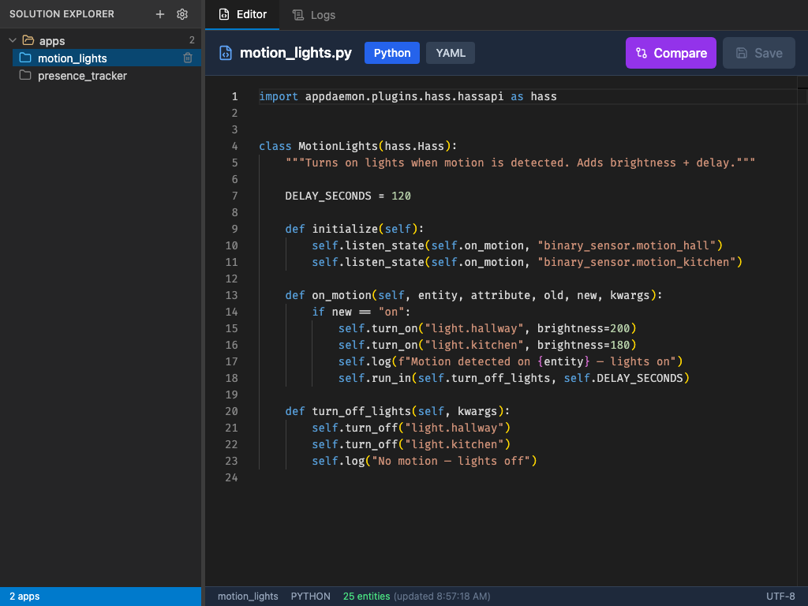
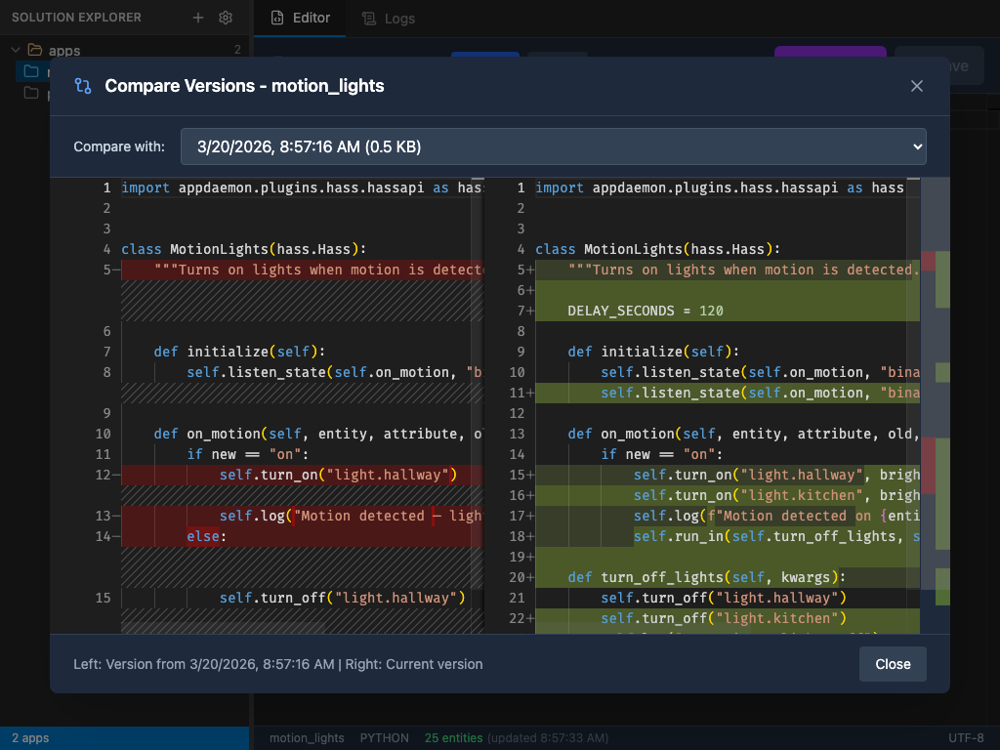
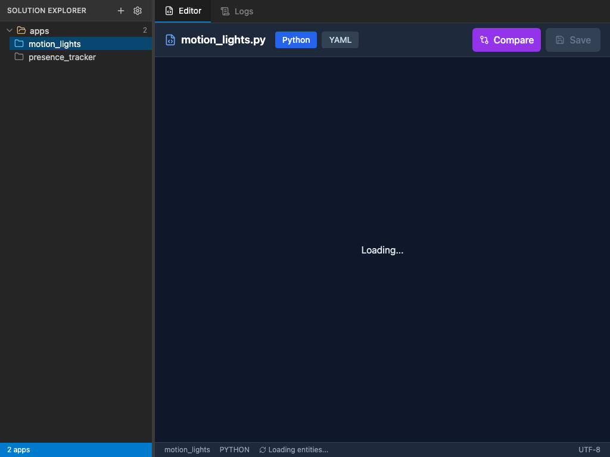
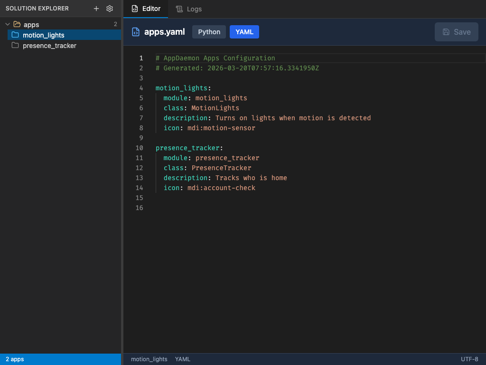
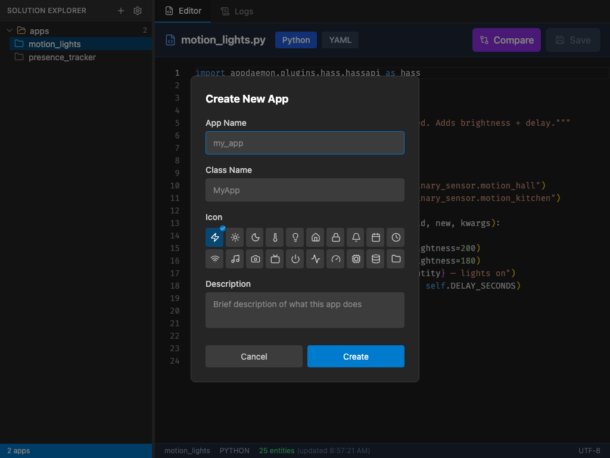
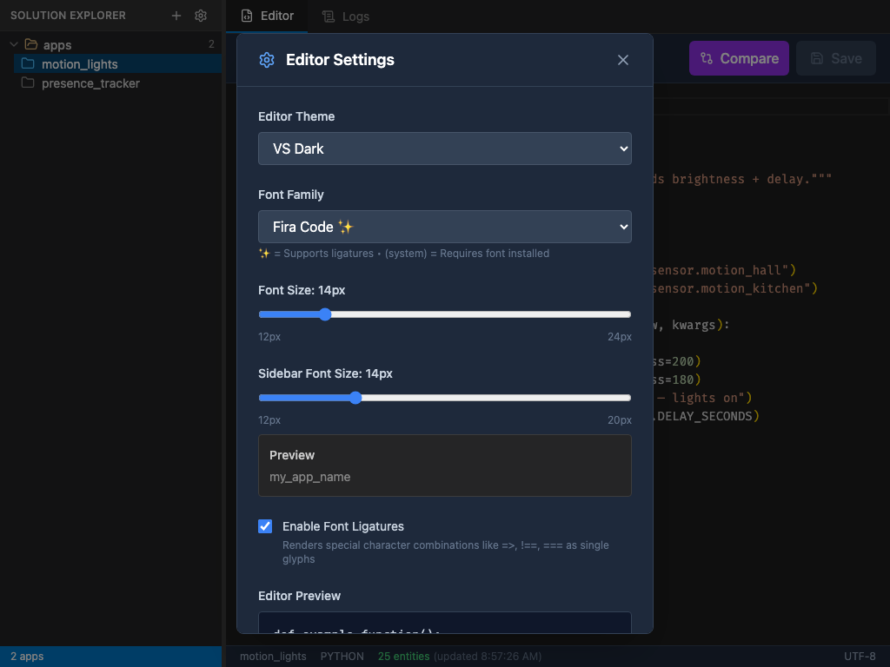
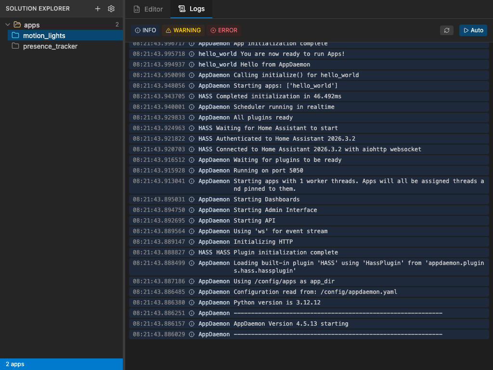
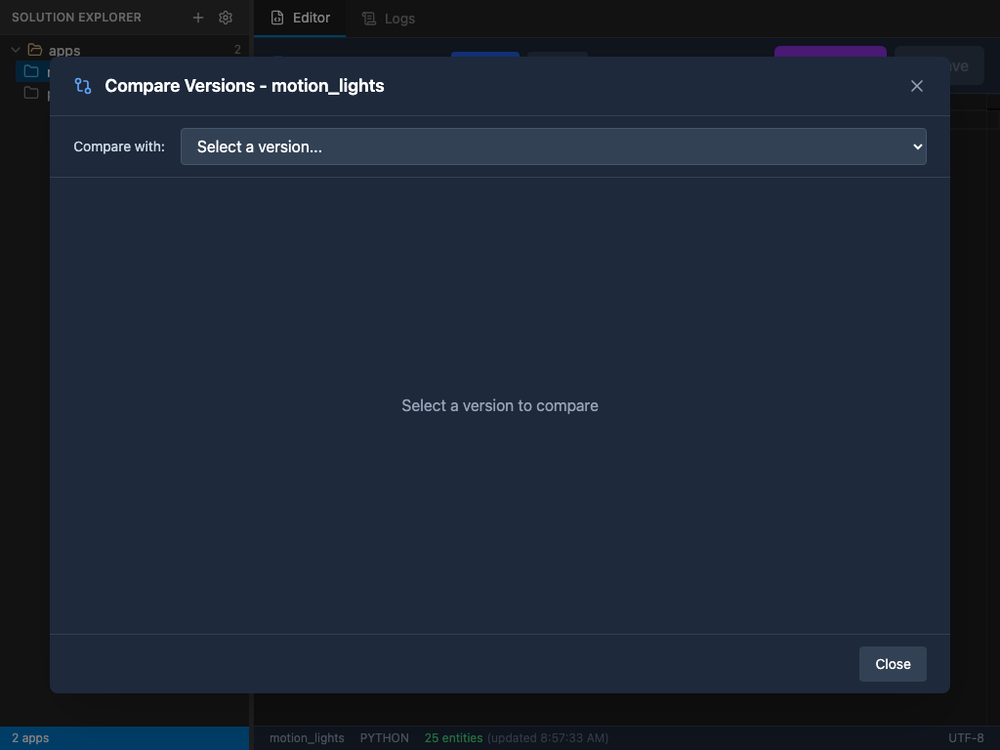

# AppDaemon Studio

[![GitHub Release][releases-shield]][releases]
![Project Stage][project-stage-shield]
[![License][license-shield]](LICENSE.md)

![Supports aarch64 Architecture][aarch64-shield]
![Supports amd64 Architecture][amd64-shield]

[![Github Actions][github-actions-shield]][github-actions]
![Project Maintenance][maintenance-shield]
[![GitHub Activity][commits-shield]][commits]

A web-based IDE for writing and managing [AppDaemon](https://appdaemon.readthedocs.io/) apps, built as a Home Assistant add-on. Runs entirely inside Home Assistant — no external services, no configuration required.

## Features

- **Monaco Editor** — The same editor as VS Code, with Python and YAML syntax highlighting, bracket matching, and multi-cursor editing
- **Entity Autocomplete** — As you type, your Home Assistant entity IDs appear as suggestions in the editor
- **Version Control** — Every save creates a snapshot. Compare any two versions side-by-side and restore with one click
- **Log Viewer** — Live AppDaemon logs with INFO / WARNING / ERROR filtering and per-app filtering
- **Multiple Themes** — VS Dark, One Dark Pro, Dracula, GitHub Dark, Nord, Monokai, and more
- **Font Options** — Fira Code, JetBrains Mono, Cascadia Code (all with ligature support)

## Installation

1. In Home Assistant, go to **Settings → Add-ons → Add-on Store**
2. Search for **AppDaemon Studio** and install it
3. Start the add-on
4. Click **Open Web UI** — or find it in your sidebar

No configuration needed. The add-on automatically connects to your Home Assistant instance and detects your AppDaemon apps in `/config/apps/`.

## Requirements

- Home Assistant with Supervisor (OS or Container installs)
- [AppDaemon add-on](https://github.com/hassio-addons/addon-appdaemon) installed and running

## Usage

### Editing apps

Select an app from the sidebar to open it in the editor. Switch between the **Python** and **YAML** tabs to edit the code or the `apps.yaml` config. Press **Save** (or `Ctrl+S`) to save.

### Creating a new app

Click the **+** button in the sidebar. Give it a name (lowercase, underscores only), a class name, an icon, and an optional description. A boilerplate Python file and a `apps.yaml` entry are created automatically.

### Entity autocomplete

While editing Python, type any quote character to trigger entity ID suggestions pulled live from your Home Assistant instance. Works for `entity_id`, `listen_state`, `turn_on`, etc.

### Version history and diff

Every time you save a Python file, the previous version is automatically snapshotted. Click **Compare** to open the diff viewer and select any saved version to see a side-by-side diff against the current file.

### Log viewer

Click the **Logs** tab to see live AppDaemon output. Filter by level (INFO / WARNING / ERROR) or by a specific app name.

## Standalone mode (without Supervisor)

AppDaemon Studio can also run outside of Home Assistant by setting environment variables:

| Variable | Description |
|---|---|
| `HA_URL` | Your Home Assistant URL, e.g. `http://192.168.1.10:8123` |
| `HA_TOKEN` | A long-lived access token from your HA profile |
| `APPS_DIR` | Path to your config root (default `/config`) |
| `APPDAEMON_LOG_FILE` | Path to AppDaemon log file (if not using Supervisor) |

## More screenshots

| | |
|---|---|
|  |  |
| Sidebar with app list | YAML config editor |
|  |  |
| Create new app dialog | Editor settings |
|  |  |
| Live log viewer | Version compare — select a snapshot |

## Support

Found a bug or have a feature request? [Open an issue](https://github.com/0x414c49/AppDaemon-Studio/issues)

## License

MIT

[releases-shield]: https://img.shields.io/github/release/0x414c49/AppDaemon-Studio.svg?style=for-the-badge
[releases]: https://github.com/0x414c49/AppDaemon-Studio/releases
[project-stage-shield]: https://img.shields.io/badge/project%20stage-production%20ready-brightgreen?style=for-the-badge
[license-shield]: https://img.shields.io/github/license/0x414c49/AppDaemon-Studio.svg?style=for-the-badge
[aarch64-shield]: https://img.shields.io/badge/aarch64-yes-green?style=for-the-badge
[amd64-shield]: https://img.shields.io/badge/amd64-yes-green?style=for-the-badge
[github-actions-shield]: https://img.shields.io/github/actions/workflow/status/0x414c49/AppDaemon-Studio/build.yml?style=for-the-badge
[github-actions]: https://github.com/0x414c49/AppDaemon-Studio/actions
[maintenance-shield]: https://img.shields.io/maintenance/yes/2026?style=for-the-badge
[commits-shield]: https://img.shields.io/github/commit-activity/y/0x414c49/AppDaemon-Studio.svg?style=for-the-badge
[commits]: https://github.com/0x414c49/AppDaemon-Studio/commits/main
