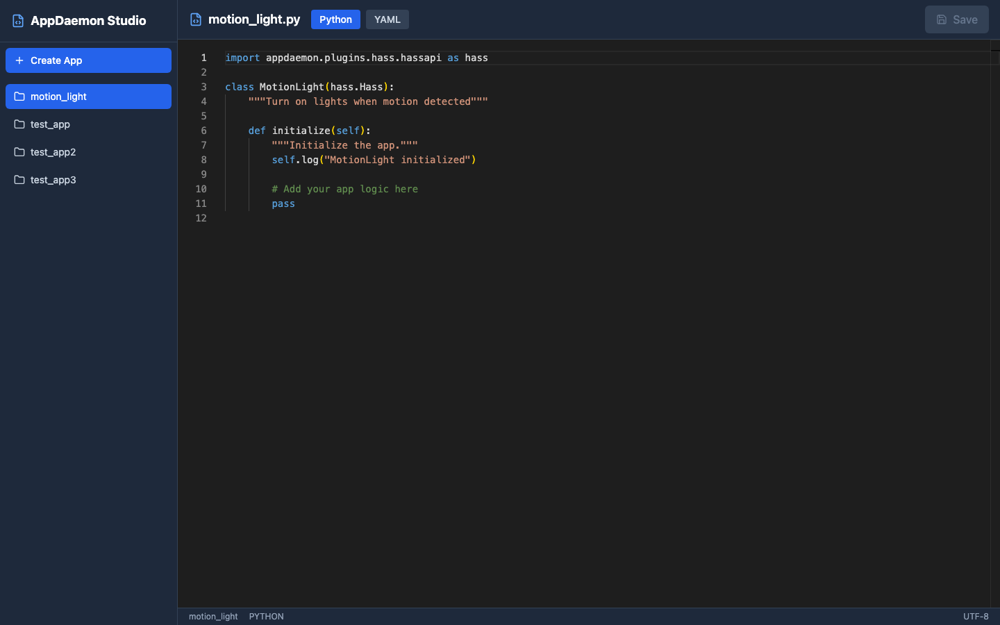
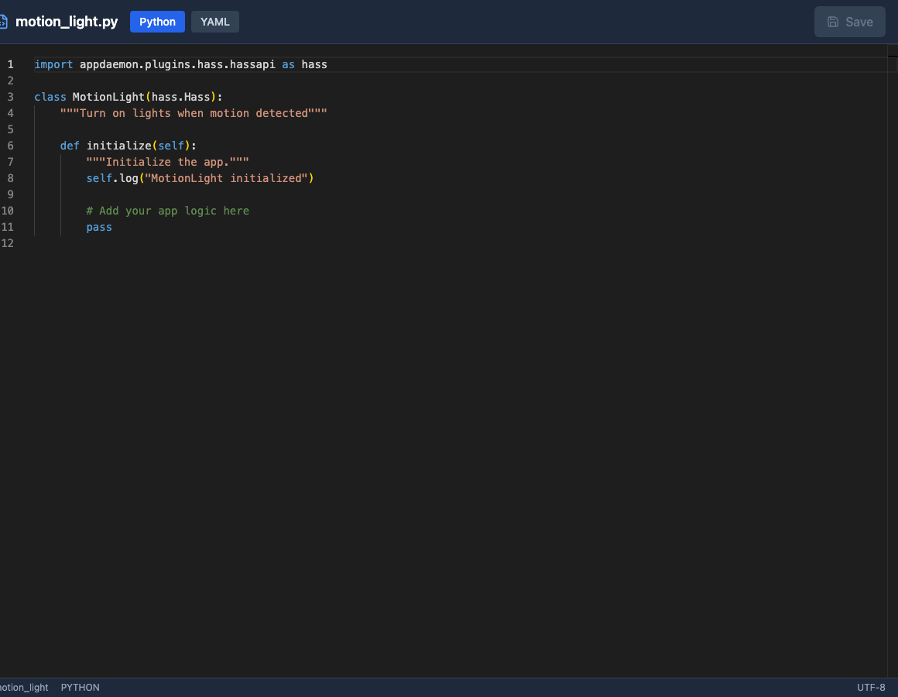
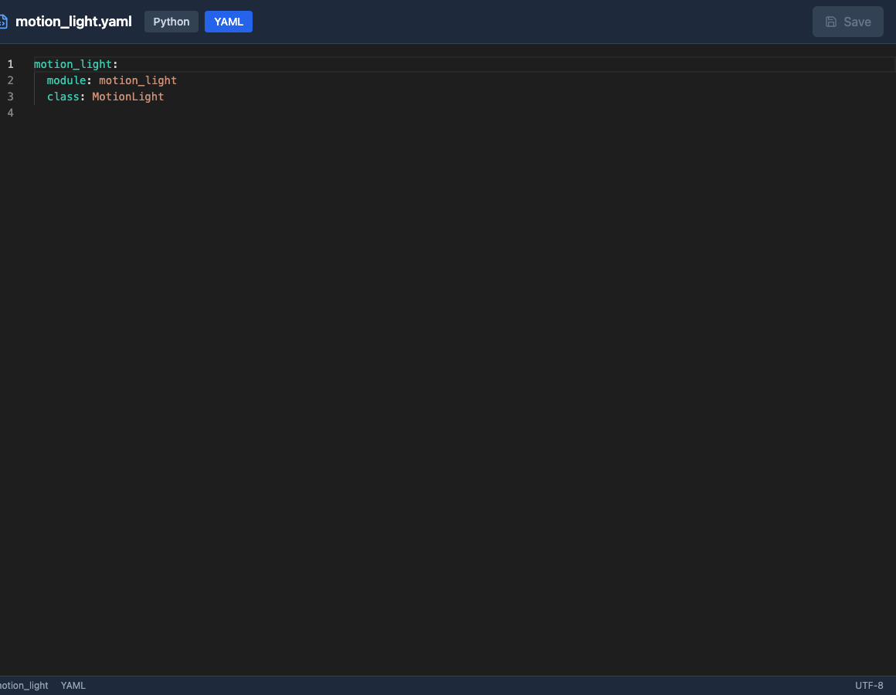

# AppDaemon Studio

Write and manage your Home Assistant automations faster with a proper code editor.

## What it does

AppDaemon Studio gives you a real IDE for writing AppDaemon apps in Home Assistant. No more editing Python files through SSH or struggling with basic text editors. Get syntax highlighting, automatic backups, and a clean interface designed for actual coding work.

## Why use it

- **Code faster** - Monaco editor (same as VS Code) with Python/YAML syntax highlighting
- **Never lose work** - Automatic backups every time you save
- **Stay organized** - All your apps in one place with clear naming
- **Works where you are** - Access directly from Home Assistant sidebar

## Installation

1. Add this repository to your Home Assistant Add-on Store
2. Install "AppDaemon Studio"  
3. Click "Start"
4. Access from your Home Assistant sidebar

That's it. No configuration needed.

## Getting started

**Create an app:**
- Click the "+" button
- Name it (e.g., "motion_lights")
- Start coding

**Edit an app:**
- Click any app in the sidebar
- Switch between Python and YAML tabs
- Save when done (version backed up automatically)

## Screenshots

*All your apps organized in one place*

*Full-featured Python editing*

*Configuration files made easy*

## Requirements

- Home Assistant
- AppDaemon installed (the add-on uses your existing AppDaemon setup)

## Support

Found a bug or have a feature request? [Open an issue](https://github.com/0x414c49/AppDaemon-Studio/issues)

## License

MIT
