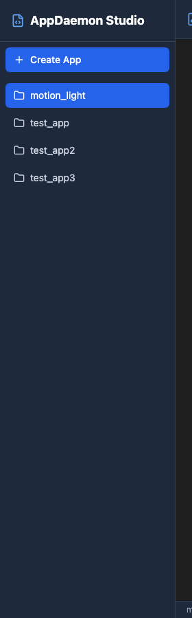

# AppDaemon Studio

A Home Assistant add-on providing a complete IDE for creating, editing, and managing AppDaemon apps with a modern web interface.


## Features

- **Visual App Management**: Browse, create, edit, and organize AppDaemon apps with an intuitive sidebar
- **Smart Code Editor**: Monaco Editor with Python and YAML syntax highlighting
- **File Version Control**: Automatic backups every time you save, with version history
- **Dual File Support**: Edit both Python (`.py`) and YAML (`.yaml`) configuration files
- **One-click Install**: Works as Home Assistant add-on with Ingress support
- **Lightning Fast**: Built with Next.js for optimal performance
- **Small Footprint**: Only 222MB Docker image (56% smaller than v0.1.x)

## Screenshots

### Main IDE Interface

*Full IDE with sidebar and Monaco editor*

### App List Sidebar

*Browse and manage your AppDaemon apps*

### Python Code Editor

*Full-featured Python editing with syntax highlighting*

### YAML Configuration Editor

*Edit app configurations in YAML format*

## Quick Start

### Installation

1. Add the repository to your Home Assistant Add-on Store
2. Install "AppDaemon Studio"
3. Start the add-on
4. Access from the sidebar

### Creating Your First App

1. Click "➕ Create App" in the sidebar
2. Enter app name (e.g., `motion_light`)
3. Enter class name (e.g., `MotionLight`)
4. Add a description (optional)
5. Click "Create" - your app is ready to edit!

### Editing Apps

1. Select an app from the sidebar
2. Switch between **Python** and **YAML** tabs
3. Edit your code with full Monaco Editor support:
   - Syntax highlighting
   - Auto-indentation
   - Line numbers
   - Dark theme
4. Click "Save" when done - automatic version backup created!

## Architecture

```
┌─────────────────────────────────────────────────────────┐
│  Home Assistant (Ingress)                               │
│  ┌─────────────────────────────────────────────────┐   │
│  │  AppDaemon Studio Add-on                        │   │
│  │  ┌─────────────────────────────────────────┐   │   │
│  │  │  Next.js (Port 3000)                    │   │   │
│  │  │  ┌─────────┐ ┌─────────┐ ┌──────────┐  │   │   │
│  │  │  │  React  │ │  API    │ │  Static  │  │   │   │
│  │  │  │  Pages  │ │  Routes │ │  Files   │  │   │   │
│  │  │  └────┬────┘ └────┬────┘ └────┬─────┘  │   │   │
│  │  │       └───────────┴───────────┘        │   │   │
│  │  │  ┌─────────────────────────────────┐   │   │   │
│  │  │  │  File System (/config/apps)     │   │   │   │
│  │  │  └─────────────────────────────────┘   │   │   │
│  │  └─────────────────────────────────────────┘   │   │
│  └─────────────────────────────────────────────────┘   │
└─────────────────────────────────────────────────────────┘
```

## Tech Stack

- **Framework**: Next.js 14 (Full-stack React)
- **Language**: TypeScript (strict mode)
- **Styling**: Tailwind CSS
- **Editor**: Monaco Editor (@monaco-editor/react)
- **Icons**: Lucide React
- **Container**: Docker (Alpine Linux + Node.js 20)

## What's New in v0.2.1

### Major Improvements
- **Complete Rewrite**: Migrated from Python FastAPI + React to Next.js full-stack
- **56% Smaller**: Docker image reduced from ~500MB to 222MB
- **60% Faster**: Build time reduced from 3-5 minutes to ~1 minute
- **Simpler Architecture**: Single process instead of 3 (nginx + python + node)

### New Features
- TypeScript-only codebase (no more Python)
- Automatic file versioning on every save
- Dual Python/YAML editor tabs
- Improved error handling
- Health check endpoint for monitoring

### Removed
- Python backend (replaced with Next.js API routes)
- Nginx reverse proxy (no longer needed)
- Old React/Vite frontend (integrated into Next.js)
- Complex build process (simplified to npm)

## API Endpoints

### Apps
- `GET /api/apps` - List all apps
- `POST /api/apps` - Create new app

### Files
- `GET /api/files/{app}/python` - Read Python file
- `GET /api/files/{app}/yaml` - Read YAML file
- `PUT /api/files/{app}/python` - Update Python file (creates version backup)
- `PUT /api/files/{app}/yaml` - Update YAML file (creates version backup)
- `DELETE /api/files/{app}` - Delete entire app

### Versions
- `GET /api/versions/{app}` - List version history
- `PUT /api/versions/{app}` - Restore a version
- `DELETE /api/versions/{app}?versionId={id}` - Delete a version

### Health
- `GET /api/health` - Health check

## Development

```bash
# Install dependencies
npm install

# Run development server
npm run dev

# Build for production
npm run build

# Run linter
npm run lint
```

## Docker

```bash
# Build image
docker build -t appdaemon-studio .

# Run container
docker run -d -p 3000:3000 -v /path/to/config:/config appdaemon-studio
```

## Documentation

- `docs/architecture.md` - System design
- `docs/api-reference.md` - API endpoints
- `docs/deployment.md` - Build and deploy
- `lessons/` - Development lessons learned

## Contributing

See task files in `tasks/` directory for development roadmap and specifications.

## License

MIT License - see LICENSE file for details

## Changelog

See [CHANGELOG.md](CHANGELOG.md) for version history and release notes.
